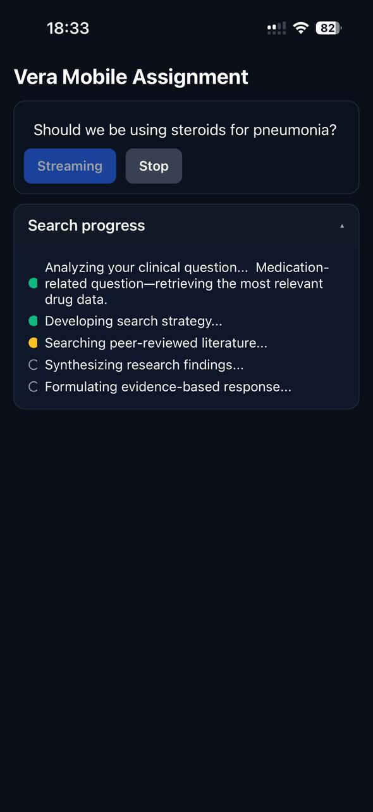
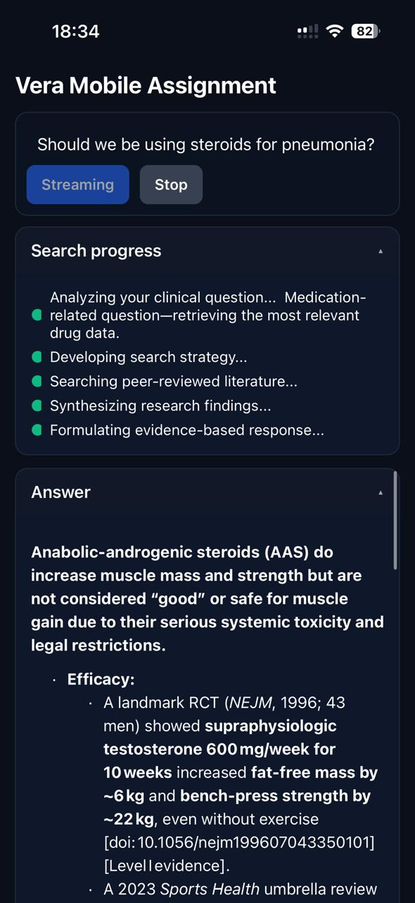
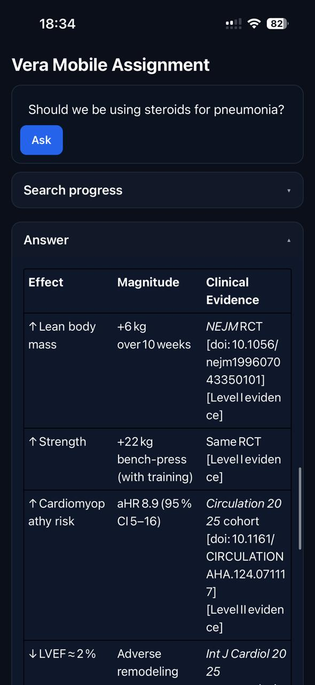

# Vera Health Assignment Demo

Expo React Native app that streams SSE from the assignment API, renders markdown as it arrives, and turns tagged blocks like `<guideline>` and `<drug>` into collapsible sections. It also shows live SEARCH_STEPS.


## Screenshots

<p align="center">
  
</p>

<p align="center">
  
</p>

<p align="center">
  
</p>

<p align="center">
  
</p>

## Demo video

<!-- GitHub sometimes refuses to inline MP4. Try the player first, then provide a link. -->
<p align="center">
  <video src="docs/demo-720p.mp4" controls muted width="720"></video>
</p>

If the player above does not appear in your browser, use this link instead  
[▶️ Watch the demo video](docs/demo-720p.mp4)


## What this app does

- Connects to  
  `https://vera-assignment-api.vercel.app/api/stream?prompt=<encoded-prompt>`
- Handles both top level `{"type":"STREAM"}` chunks and `{"type":"NodeChunk","content":{"nodeName":"STREAM"}}`
- Parses `<guideline>` and `<drug>` into collapsible cards
- Renders text outside tags as normal markdown
- Displays SEARCH_STEPS with active and done states
- Batches UI updates with requestAnimationFrame for smooth rendering

## Quick start

Requirements

- Node 18 or 20
- Xcode for iOS simulator or Android Studio for emulator

Run

```bash
npm i
npx expo start -c
# press i for iOS or a for Android
